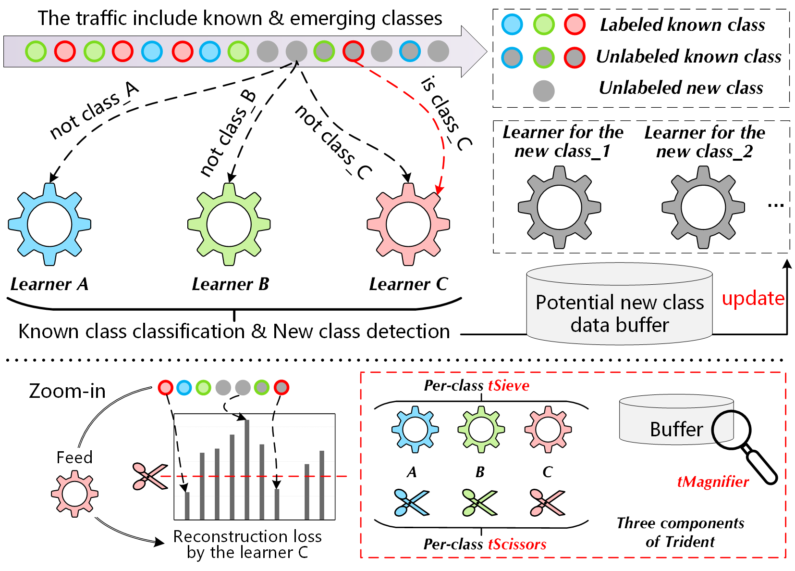
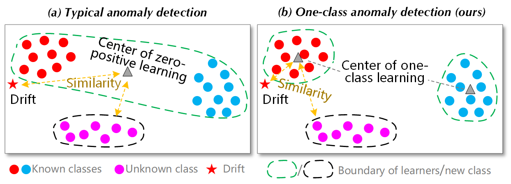

### Trident: A Universal Framework for Fine-Grained and Class-Incremental Unknown Traffic Detection



## Introduction

Trident is a novel framework to detect unknown attack traffic in a fine-grained and incremental manner. It can realize known class classification, fine-grained unknown class detection, and incremental model updates (including sample increments and class increments). At a high level, Trident consists of three tightly coupled components named tSieve, tScissors, and tMagnifier. They are responsible for profiling traffic, determining outlier thresholds, and clustering respectively. 



## Requirements

```bash
pip install scipy
pip install numpy
pip install pandas
pip install matplotlib
pip install sklearn
pip install torch
```

## Model Architecture

The AutoEncoder model architecture is stored in ./code/portrayer.py. 
```bash
portrayer.py
```

## Outlier Detection

The Extreme Value Theory (EVT) calculations is stored in ./code/evt.py. 
```bash
evt.py
```

## Demo Dataset

A demo of the demo dataset based on KDDCup 99 is stored in ./code/data_loader.py. 
```bash
data_loader.py
```

## Running

To perform this test code, enter the ./code/ folder, run with
```bash
python main_process.py
```

### References
- [New Directions in Automated Traffic Analysis](https://doi.org/10.1145/3460120.3484758), 	Jordan Holland, Paul Schmitt, Nick Feamster, Prateek Mittal - CCS 2021
- [FlowPic: Encrypted Internet Traffic Classification is as Easy as Image Recognition](https://ieeexplore.ieee.org/document/8845315), Tal Shapira, Yuval Shavitt - INFOCOM Workshops 2019
- [FlowLens: Enabling Efficient Flow Classification for ML-based Network Security Applications](https://www.ndss-symposium.org/ndss-paper/flowlens-enabling-efficient-flow-classification-for-ml-based-network-security-applications/), Diogo Barradas, Nuno Santos, Luís Rodrigues, Salvatore Signorello, Fernando M. V. Ramos, André Madeira - NDSS 2021
- [ERNN: Error-Resilient RNN for Encrypted Traffic Detection towards Network-Induced Phenomena](https://ieeexplore.ieee.org/document/10036003), Ziming Zhao, Zhaoxuan Li, Jialun Jiang, Fengyuan Yu, Fan Zhang, Congyuan Xu, Xinjie Zhao, Rui Zhang, Shize Guo - TDSC 2023
- [ET-BERT: A Contextualized Datagram Representation with Pre-training Transformers for Encrypted Traffic Classification](https://dl.acm.org/doi/10.1145/3485447.3512217), Xinjie Lin, Gang Xiong, Gaopeng Gou, Zhen Li, Junzheng Shi, Jing Yu - WWW 2022

- [Kitsune: An Ensemble of Autoencoders for Online Network Intrusion Detection](https://arxiv.org/abs/1802.09089), Yisroel Mirsky, Tomer Doitshman, Yuval Elovici, Asaf Shabtai - NDSS 2018
- [Realtime Robust Malicious Traffic Detection via Frequency Domain Analysis](https://dl.acm.org/doi/10.1145/3460120.3484585), Chuanpu Fu, Qi Li, Meng Shen, Ke Xu - CCS 2021
- [DeepLog: Anomaly Detection and Diagnosis from System Logs through Deep Learning](https://dl.acm.org/doi/10.1145/3133956.3134015), Min Du, Feifei Li, Guineng Zheng, Vivek Srikumar - CCS 2021
- [Detecting Unknown Encrypted Malicious Traffic in Real Time via Flow Interaction Graph Analysis](https://www.ndss-symposium.org/ndss-paper/detecting-unknown-encrypted-malicious-traffic-in-real-time-via-flow-interaction-graph-analysis/), Chuanpu Fu, Qi Li, Ke Xu - NDSS 2023
- [Random Partitioning Forest for Point-Wise and Collective Anomaly Detection—Application to Network Intrusion Detection](https://ieeexplore.ieee.org/document/9319404), Pierre-Francois Marteau - TIFS 2021

- [FlowPrint: Semi-Supervised Mobile-App Fingerprinting on Encrypted Network Traffic](https://www.ndss-symposium.org/ndss-paper/flowprint-semi-supervised-mobile-app-fingerprinting-on-encrypted-network-traffic/), Thijs van Ede, Riccardo Bortolameotti, Andrea Continella, Jingjing Ren, Daniel J. Dubois, Martina Lindorfer, David Choffnes, Maarten van Steen, Andreas Peter - NDSS 2020
- [Conditional Variational Auto-Encoder and Extreme Value Theory Aided Two-Stage Learning Approach for Intelligent Fine-Grained Known/Unknown Intrusion Detection](https://ieeexplore.ieee.org/document/9439944), Jian Yang, Xiang Chen, Shuangwu Chen, Xiaofeng Jiang, Xiaobin Tan - TIFS 2021
- [Classification Under Streaming Emerging New Classes: A Solution Using Completely-Random Trees](https://ieeexplore.ieee.org/abstract/document/7893709), Xin Mu, Kai Ming Ting, Zhi-Hua Zhou - TKDE 2017
- [FARE: Enabling Fine-grained Attack Categorization under Low-quality Labeled Data](https://www.ndss-symposium.org/ndss-paper/fare-enabling-fine-grained-attack-categorization-under-low-quality-labeled-data/), Junjie Liang, Wenbo Guo, Tongbo Luo, Vasant Honavar, Gang Wang, Xinyu Xing - NDSS 2021
