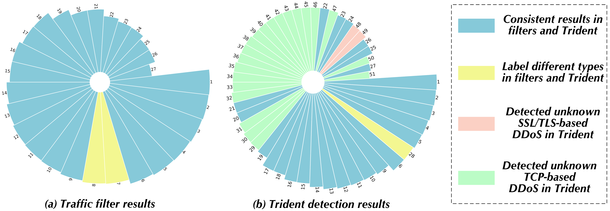
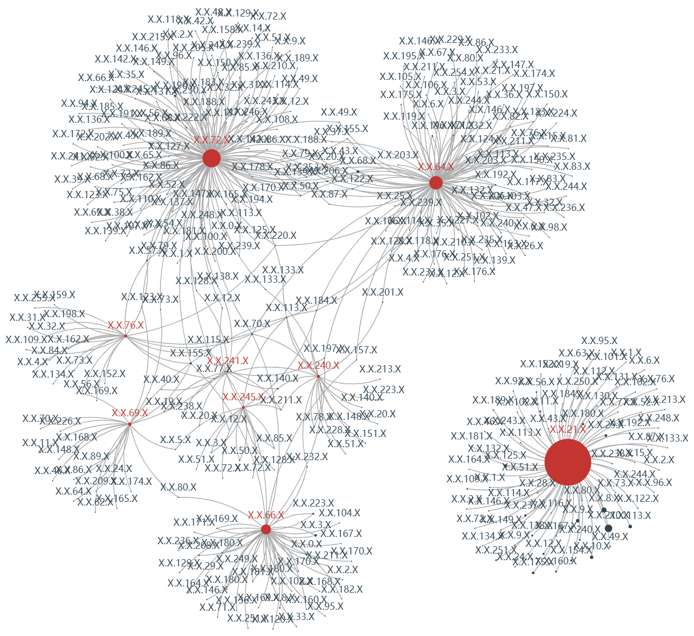

### Some insight/external validation in the real world.

---

**We already deployed Trident on the datacenter of the local Internet Service Provider (ISP) to analyze mirrored egress traffic.** This egress traffic involves >200K active hosts and we monitored it across 2022~2023. In the beginning, we adopted Trident (AE) model and deployed 12 one-class learner instances corresponding to common services such as cloud service, file transfer, instant messaging, media, games, etc. 

During this period, we continued to use Trident to detect emerging DDoS attacks. Meanwhile, the ISP purchases the filtering service of the security manufacturers, and we refer to these results for analysis. **We report the traffic filter results and our detection results by Trident** in the figure below. We observe that the filter found 27 types of attack and Trident detected 49 categories. After manual analysis, we found 25 types of attacks are coincident (blue mark) between the filter and Trident, the top-5 are ''SYN Flood'', ''UDP Flood'', ACK Flood'', ''NTP Reflection'', and ''SSDP Reflection''. The yellow mark refers to different labels in the filter and Trident, i.e., it is reported as ''HTTP Post Flood'' and ''HTTP Get Flood'' in the filter while Trident regards them as one attack. This is because our feature extraction does not involve the detailed fields of the application layer protocol (e.g., HTTP), and could not distinguish them. **The discovered attacks only in Trident include 21 TCP-based (green mark) and 2 SSL/TLS-based (red mark).** These TCP-based attacks are mainly flooding by combining various flags, some typical representatives are ''ACK-PSH'', ''URG-ACK'', ''SYN-FIN'', ''ACK-RET-FIN'', ''URG-SYN'' and so on. The samples of these types are not very large compared to the previous attack types but do cause certain bandwidth consumption. The other is the SSL/TLS-based attack, the detected two attacks are very similar to ''SSL Renegotiation'' and ''THC-SSL Attack'' by artificial comparison. They continue to establish handshakes and negotiate keys to achieve the effect of DDoS, with different SSL/TLS versions (e.g., SSL3.0 and TLS1.2).

Specifically, the attack classes corresponding to each ID are as follows.

| ID |        Class        | ID |          Class         | ID |        Class       | ID |      Class      | ID |           Class          |
|:---:|:-------------------:|:---:|:----------------------:|:---:|:------------------:|:---:|:---------------:|:---:|:------------------------:|
|  1  |      SYN-Flood      |  2  |        UDP-Flood       |  3  |      ACK-Flood     |  4  |    NTP-Flood    |  5  |           SSDP           |
|  6  |    SYN-ACK-Flood    |  7  |     HTTP-Post-Flood    |  8  |   HTTP-Get-Flood   |  9  |  IP-Fragmented  |  10 |   TCP-Connection-Flood   |
|  11 |     HTTPS-Flood     |  12 |          SNMP          |  13 |  DNS-Size-Abnormal |  14 |    ICMP-Flood   |  15 |       DNS-Response       |
|  16 |     DNS-Request     |  17 |          CLDAP         |  18 | UDP-Fragment-Flood |  19 |       SIP       |  20 |       FIN-RST-Flood      |
|  21 |       ACK-RST       |  22 | TCP-Bandwidth-Overflow |  23 |    UDP-Malformed   |  24 |  TCP-Malformed  |  25 | Other-Bandwidth-Overflow |
|  26 |         RST         |  27 |        FIN-Flood       |  28 |     HTTP-Flood     |  29 |     ACK-PSH     |  30 |          URG-ACK         |
|  31 |       SYN-FIN       |  32 |       ACK-RST-FIN      |  33 |       URG-SYN      |  34 |   URG-PSH-SYN   |  35 |        ACK-PSH-FIN       |
|  36 |     URG-ACK-PSH     |  37 |       PSH-SYN-FIN      |  38 |     URG-ACK-RST    |  39 | ACK-PSH-RST-FIN |  40 |    URG-ACK-RST-SYN-FIN   |
|  41 |     RST-SYN-FIN     |  42 |     URG-ACK-PSH-FIN    |  43 |   URG-ACK-PSH-RST  |  44 |   URG-PSH-FIN   |  45 |          URG-FIN         |
|  46 |       URG-PSH       |  47 |           PSH          |  48 |  SSL-Renegotiation |  49 |     THC-SSL     |  50 |        PSH-RST-SYN       |
|  51 | ACK-PSH-RST-SYN-FIN |     |                        |     |                    |     |                 |     |                          |

---

**We also plot the local network topology diagram after IP anonymization** in the figure below. The ''red node'' denotes the victims and the ''black node'' represents the attackers.  We can see that the victim whose IP is ''X.X.21.X'' has been attacked in a concentrated manner, and the attackers are well-targeted. While some other servers (e.g., ''X.X.76.X'', ''X.X.69.X'', ''X.X.241.X'') were attacked indiscriminately and the topological relationships are relatively scattered.

Under-identification of DDoS attack traffic may cause bandwidth congestion and missing some damaged nodes, and **the detection results of Trident provide significant help to a certain extent.** In addition, profiling the used attack techniques and the compromised source address could benefit in characterizing the portrait of attacking organizations. *We have started to utilize Trident to support and enhance the corresponding research about attack organization portrays.*

